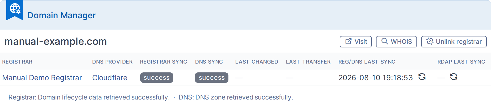
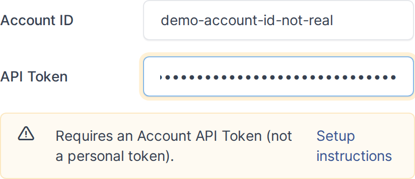

# 1. Introduction

> Generated for **domainmanager 1.7.1** on GLPI 11.0 — 2026-08-11. Screenshots are produced automatically; do not edit generated sections by hand.

*Part of the domainmanager manual — see also [2. Setup](02-setup.md), [3. Usage](03-usage.md), [4. Troubleshooting](04-troubleshooting.md).*

## 1.1 What is Domain Manager

Domain Manager keeps GLPI's Domain and DNS record inventory synchronized with real registrar and DNS provider accounts (Cloudflare, IONOS, Dinahosting), and auto-detects the provider behind any domain even without credentials.

## 1.2 Pain points it addresses

- Native GLPI treats Domains and DNS Records as manually-entered inventory — nothing tells you a domain expired, whether WHOIS privacy or transfer lock is on, or whether the DNS record in GLPI still matches what's live at the provider.
- Without this plugin, "is our inventory accurate?" means logging into each registrar/DNS panel one by one. There is no official plugin that talks to registrar/DNS APIs.
- Editing a DNS record in GLPI normally does nothing to the real zone — teams end up maintaining two copies by hand, which drift silently. Domain Manager can push changes live and locks fields that were just synced so nobody overwrites fresh data by accident.

## 1.3 Features

- Registrar sync: pulls registration date, expiry date, status, and lock/privacy/DNSSEC/auto-renew flags into each Domain.
- DNS sync: pulls zone records (A, AAAA, ALIAS, CNAME, MX, NS, PTR, SOA, SRV, TXT, CAA) into DomainRecord, tagging which ones are provider-managed vs. hand-added in GLPI.
- DNS write-back: create/update/delete A, AAAA, CNAME, and TXT records directly from the GLPI form (Cloudflare and IONOS), including Cloudflare proxy toggle, TTL, and validation (invalid hosts/IPs, CNAME-at-apex, SPF/DMARC length).
- Provider auto-detection: identifies the DNS provider for any domain from its NS records, even for providers with no write driver (20+ recognized, e.g. Route 53, Azure DNS, GoDaddy, OVHcloud, Namecheap, Hetzner, cdmon, Arsys...).
- Bulk domain discovery: imports every domain in a registrar/DNS account in one go.
- RDAP enrichment: fills in missing registration metadata from public RDAP records, rate-limited per domain.
- Field/record locking: fields and records populated by sync are locked against manual edits unless the user holds the unlock right.
- Reconciliation safety guard: refuses a sync that would trash an excessive number of records without confirmation, preventing a bad API response from wiping a zone.
- Dashboard cards: managed domains by registrar, by DNS provider, by TLD, sync status breakdowns, expiring-soon count, and managed DNS records by type/provider.
- Massive action "Sync now" to force a sync on selected domains.
- Full IDN/punycode support for internationalized domain names.
- Multi-entity aware, with per-entity breakdowns in sync logs and entity-scoped rights.

## 1.4 Supported nameservers & drivers

Three drivers cover both registrar (lifecycle) data and DNS zone data; the proxy toggle is a Cloudflare-specific feature (Cloudflare's "orange cloud" CDN/proxying):

| Provider | Registrar (lifecycle) | DNS sync (read) | DNS write-back | Proxy toggle |
|---|---|---|---|---|
| Cloudflare | Yes | Yes | Yes | Yes |
| IONOS | Yes | Yes | Yes | No |
| Dinahosting | Yes | Yes | Yes | No |

Beyond these three, Domain Manager auto-detects a domain's DNS provider from its NS records even without any credentials configured — useful for portfolio-wide visibility even where you don't hold an API key. Auto-detection alone has no write-back. Recognized providers:

- Ascio
- AWS Route 53
- Google Cloud DNS
- Azure DNS
- GoDaddy
- OVHcloud
- DigitalOcean
- Linode (Akamai)
- Vercel
- Gandi
- Namecheap
- Hetzner
- Hostalia
- Squarespace
- Wix
- Hostinger
- Porkbun
- cdmon
- one.com
- NS1 (IBM NS1 Connect)
- bunny.net (Bunny DNS)
- Strato
- Arsys
- RaiolaNetworks
- LucusHost

## 1.5 Affected GLPI elements

Reference only — see [2. Setup](02-setup.md) for how to configure each of these.

### 1.5.1 Assets, management & administration items

**Assets**

- Domain
- Domain Record

**Management**

- Supplier (adds a "Domain Manager" tab: API driver/credentials, linked domains)

**Administration**

- Profiles (adds a "Domain Manager" rights tab)

**Setup**

- General (adds a "Domain Manager" configuration tab)
- Automatic actions (2 new cron tasks)
- Dropdowns: Domain Type (1 type auto-seeded). Domain Record Type's 11 values (A, AAAA, ALIAS, CNAME, MX, NS, PTR, SOA, SRV, TXT, CAA) are native GLPI dropdown data, not injected by this plugin — it only re-creates one if an administrator deleted it.

### 1.5.2 Automatic actions

- DomainSync
- RdapEnrichment

See [2.2 Configuration](02-setup.md#22-configuration).

### 1.5.3 Notifications

None — the plugin does not use GLPI's notification system. Sync activity and errors are written to dedicated activity/error logs instead.

### 1.5.4 Rules

None — Domain Manager does not add criteria or actions to GLPI's Rules engine.

### 1.5.5 Permissions

- Unlock imported domain data
- DNS records – A
- DNS records – AAAA
- DNS records – CNAME
- DNS records – TXT
- Standard `config` right

See [2.3 Permissions](02-setup.md#23-permissions).
