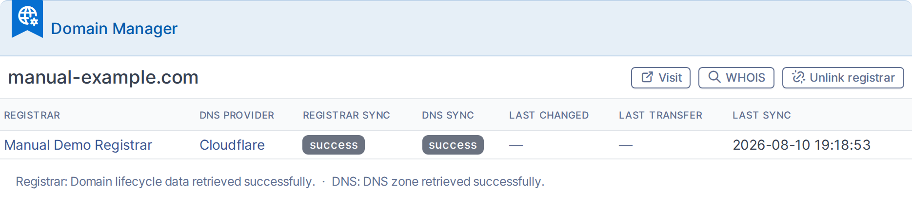
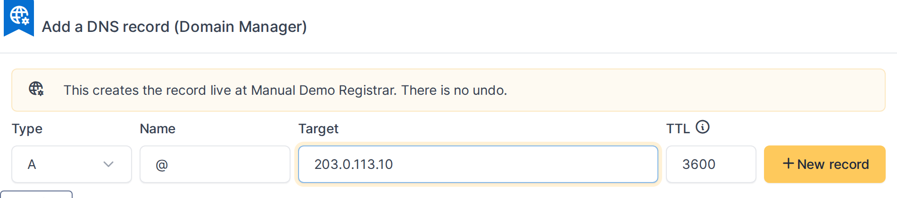
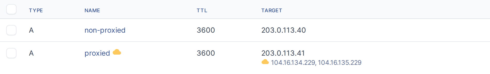

# domainmanager — User Manual

<!-- GENERATED FILE — edit the specs in tools/manual-generator/specs/ or _intro.md / _outro.md -->
> Generated for **domainmanager 1.7.1-beta2** on GLPI 11.0 — 2026-08-11. Screenshots are produced automatically; do not edit this file by hand.

# Domain Manager — Usage Manual

Domain Manager tracks domain lifecycles (registration, expiry, transfer status) and DNS
zone records inside GLPI, syncing them from Cloudflare, IONOS and Dinahosting, with
auto-detection of many other DNS providers from a domain's NS records. On Cloudflare and
IONOS, DNS records can also be created, edited and deleted from GLPI, writing live to the
provider.

This manual covers what you'll do most often:

1. **Grant Domain Manager rights** to a profile, so its users can unlock synced fields and
   push DNS record changes to a provider.
2. **Configure a Supplier** with an API driver and credentials, test the connection, and
   import the domains it manages.
3. **Monitor a domain** through its Domain Manager status panel and manage its DNS
   records.

## Why this plugin?

- Native GLPI treats Domains and DNS Records as manually-entered inventory — nothing
  tells you a domain expired, whether WHOIS privacy or transfer lock is on, or whether the
  DNS record in GLPI still matches what's live at the provider.
- Without this plugin, "is our inventory accurate?" means logging into each registrar/DNS
  panel one by one. There is no official plugin that talks to registrar/DNS APIs.
- Editing a DNS record in GLPI normally does nothing to the real zone — teams end up
  maintaining two copies by hand, which drift silently. Domain Manager can push changes
  live and locks fields that were just synced so nobody overwrites fresh data by accident.

## Supported registrars and DNS providers

Three drivers cover both registrar (lifecycle) data and DNS zone data; the proxy toggle is
a Cloudflare-specific feature (Cloudflare's "orange cloud" CDN/proxying):

| Provider | Registrar (lifecycle) | DNS sync (read) | DNS write-back | Proxy toggle |
|---|---|---|---|---|
| Cloudflare | Yes | Yes | Yes | Yes |
| IONOS | Yes | Yes | Yes | No |
| Dinahosting | Yes | Yes | No | No |

Beyond these three, Domain Manager auto-detects a domain's DNS provider from its NS
records even without any credentials configured — useful for portfolio-wide visibility
even where you don't hold an API key. Auto-detection alone has no write-back. Recognized
providers: Ascio, AWS Route 53, Google Cloud DNS, Azure DNS, GoDaddy, OVHcloud,
DigitalOcean, Linode (Akamai), Vercel, Gandi, Namecheap, Hetzner, Hostalia, Squarespace,
Wix, Hostinger, Porkbun, cdmon, one.com, NS1 (IBM NS1 Connect), bunny.net (Bunny DNS),
Strato, Arsys, RaiolaNetworks and LucusHost.

## Before you start

You'll need:

- A **Supplier** record (Management → Suppliers) to attach credentials to — Domain Manager
  adds a tab to Suppliers rather than introducing a page of its own.
- The **Supplier** UPDATE right to configure a driver, and Supplier READ to view the tab.
- For DNS write-back: a per-record-type right (A, AAAA, CNAME, TXT — each with its own
  Create/Update/Delete/Purge bits), granted per profile from the **Domain Manager** tab
  under *Administration → Profiles*.
- Real API credentials for at least one of the supported drivers. See the main
  [README](../../README.md#configuration) for what each provider requires (Cloudflare
  needs an Account API Token and Account ID; IONOS an API Key/Secret pair; Dinahosting the
  super-admin account's username and password).

This manual documents version 1.7.1-beta1 against GLPI 11.0.8.

## Contents

1. [Granting Domain Manager rights to a profile](#granting-domain-manager-rights-to-a-profile)
2. [Configuring a Supplier as a domain source](#configuring-a-supplier-as-a-domain-source)
3. [Monitoring a domain and its DNS records](#monitoring-a-domain-and-its-dns-records)
4. [Bulk-importing domains from a Supplier](#bulk-importing-domains-from-a-supplier)
5. [Editing an existing record & the managed/locked-field state](#editing-an-existing-record-the-managed-locked-field-state)
6. [Proxy vs. origin IP indicators](#proxy-vs-origin-ip-indicators)

## Granting Domain Manager rights to a profile

Domain Manager adds its own rights to GLPI’s profile system. A profile has no access to the plugin’s protected actions until an administrator grants them here — this is the first thing to check if a user reports missing DNS record buttons or an un-editable synced field.

### 1. Open the profile to edit

Go to **Administration → Profiles** and open the profile to grant rights to — here, **Technician**.

### 2. Open the Domain Manager tab

Select the **Domain Manager** tab. It lists every right the plugin defines: unlocking fields and records that came from a synchronization, and per-record-type write-back rights (Create/Update/Delete/Purge) for each DNS record type the plugin can push to a provider.

*The Domain Manager rights matrix, before any right is granted*

### 3. Grant unlock and A-record write-back rights

Tick **Edit fields and records imported by synchronization** to let this profile override plugin-managed locks on the native form, and tick **Create**/**Update** on **Domain Record: A** to let it push new and changed A records to the provider. Leave the other record types and the destructive Delete/Purge bits unchecked — grant only what a role actually needs.

*Unlock and A-record Create/Update ticked, not yet saved*

### 4. Save the profile

Click **Save**. The rights take effect immediately for every user with this profile.

> **Note:** Delete and Purge are separate bits from Create/Update on each record-type right: a profile can be trusted to push new and changed records without also being able to remove them from the provider.

## Configuring a Supplier as a domain source

Domain Manager syncs domains and DNS records through a Supplier’s API credentials. Before it can manage anything, one Supplier needs an API driver selected and its credentials entered.

### 1. Open the Domain Manager tab on a Supplier

Open the Supplier record and select its **Domain Manager** tab. This is where the API driver and credentials for that provider are configured.

*The Domain Manager tab on a Supplier, with a driver already selected*

### 2. Pick an API driver and enter credentials

Choose the **API driver** that matches this Supplier — Domain Manager currently supports Cloudflare, IONOS and Dinahosting. The fields below change to match the chosen driver; each shows exactly the credentials that provider requires.

*Credential fields for the Cloudflare driver*

### 3. Save the configuration

Click **Save**. The *Test* and *Import* actions only appear once a driver has been saved at least once — until then there is nothing configured to test.

### 4. Test the connection

Click **Test** to verify the credentials work before relying on them. The result appears in the **Connection diagnostics** panel below, including any error the provider returned — useful for catching a mistyped or under-scoped credential before a sync ever runs.

*The connection diagnostics panel after running Test*

### 5. Import the Supplier’s domains

Click **Import** to list every domain visible in that provider’s account. Domains already tracked in GLPI are shown as already existing; the rest can be selected and imported in one action. This step needs working credentials — with an invalid or under-scoped token, the dialog reports the same error **Test** did instead of a domain list.

*The domain import dialog*

> **Note:** Domains already synced through this Supplier are updated automatically by the **DomainSync** automatic action; importing here is only needed for domains Domain Manager has not seen yet.

## Monitoring a domain and its DNS records

Once a domain is managed by Domain Manager, its own record shows a live status panel — registrar, DNS provider, sync health — and its DNS zone becomes editable from GLPI when the provider supports write-back.

### 1. Open the domain’s Domain Manager panel

Open the domain from **Assets → Domains**. The **Domain Manager** panel on its main tab shows which Supplier acts as registrar and which one as DNS provider, plus a sync status badge for each — green for healthy, red for a failed sync, grey for "never synchronized".

*The Domain Manager status panel on a managed domain*

### 2. Open the domain’s DNS records

Switch to the domain’s **Records** tab to see its DNS zone. Records synced from the provider are locked against manual edits — this keeps GLPI from drifting out of sync with what the DNS provider actually serves.

*The domain’s DNS records, synced from its provider*

### 3. Add a DNS record

On a domain whose DNS provider supports write-back (here, Cloudflare), a **New record** form appears in place of the usual "Link a record" form. Creating a record here pushes it live to the DNS provider immediately, not just to GLPI's copy of the zone — the confirmation prompt exists for that reason.

*Adding an A record; this will be created live at the DNS provider*

> **Note:** Fields populated by the last sync (registration date, expiry, existing record values) are locked by default. A user with the "Unlock imported domain data" right can edit them anyway — useful when the provider reported something wrong.

## Bulk-importing domains from a Supplier

Once a Supplier's API driver is configured, Domain Manager can discover all domains in that provider's account. Importing multiple domains at once is faster than adding them one by one.

### 1. Open the Import Domains dialog

In the Domain Manager tab on a Supplier, click the **Import** button. This opens a modal showing every domain the provider's account contains that isn't already tracked in GLPI.

*The domain import dialog showing multiple domains available to import*

### 2. Select domains to import

Each domain in the list can be checked or unchecked independently. Domains already in GLPI are shown with the **Already exists** label and cannot be selected. Use the checkbox in the header to quickly select or deselect all pending domains at once.

*Two domains selected, one deselected (Domain Manager will import only the selected ones)*

### 3. Complete the import

Click **Import selected domains** to create all checked domains in GLPI. They appear immediately in your domain list and automatically start syncing on the next cron run; no manual intervention is needed after import.

> **Note:** The imported domains are now part of your domain inventory. Their first sync happens automatically on the next scheduled sync run (typically within minutes), and they sync thereafter on your configured interval.

> **Note:** Importing multiple domains at once is much faster than creating them individually. After import, all domains are treated identically: they sync automatically, show status, and support DNS record management just like any domain you created by hand.

## Editing an existing record & the managed/locked-field state

Domain Manager imports DNS records by syncing them from your provider's live account. Some records can be edited here; others are locked because the provider hasn't confirmed that your edits would succeed.

### 1. Open a record that can be edited

Navigate to a Domain's Records tab and click **Edit** on an A or CNAME record. Since this domain's DNS provider is configured and working, the form shows an alert warning that **saving updates the record live** at the provider.

*The "Managed by Domain Manager" banner warns that saving updates the record live*

*The data and TTL fields are editable (no lock icons)*

### 2. Make a change and review before saving

Type a new value (the form doesn't require you to submit, so you can review the change). Notice there's no lock icon next to **data** or **TTL** — they're fully editable.

*The form shows your change ready to save (no undo once submitted)*

### 3. Open a record that cannot be edited

Go back to the domain list and open a different domain whose DNS provider is in a **read-only state** (write-back failed or never succeeded). Records on this domain cannot be edited here.

### 4. See the locked-field explanation

The form shows an alert explaining that this record is **imported by Domain Manager synchronization** and cannot be edited. This happens when the provider hasn't confirmed that write-back would succeed.

*The alert explains why this record cannot be edited*

### 5. Notice the lock icons on editable fields

Look at the **data** and **TTL** fields — they have a lock icon next to them, indicating they're read-only. The fields are disabled, preventing any changes.

*The data field has a lock icon and is disabled*

### 6. Why records become locked

Domain Manager locks imported records until a successful write confirms the provider can push updates. Once a write succeeds, these fields unlock. If the provider returns an error, the fields stay locked (the "read-only" state shown here). A user with the **Unlock imported domain data** right can override the lock if needed.

## Proxy vs. origin IP indicators

When a domain is proxied through Cloudflare (or another proxy service), Domain Manager displays both the origin IP address and the proxy service's address. Visual indicators make it clear which records are being proxied.

### 1. Open the Records tab on a proxied domain

Navigate to a domain with some records proxied through Cloudflare. Open the **Records** tab to see the full list of DNS records.

*The records table shows both proxied (cloud icon) and non-proxied records*

### 2. Identify which records are proxied

A **cloud icon** appears next to the name of any record that is proxied through Cloudflare. This small visual indicator tells you at a glance which records have proxy enabled.

*The cloud icons next to proxied record names show which records are proxied*

### 3. See the proxy service's address

Below the **Target** (origin IP) for any proxied record, a second line shows the proxy service's address — for Cloudflare, this is the anycast IP they're using. This address is updated automatically during each sync and acts as the public-facing address for the record.

*Proxy service anycast addresses appear below the origin IP on proxied records*

## Troubleshooting

**"Test" reports an error instead of Success.**
The badge shows the specific failure — Authentication failed, Forbidden, Not found, Rate
limited, Upstream error, Network error, or Timeout — and the diagnostics panel keeps the
provider's own message. Authentication failed and Forbidden almost always mean the
credential is valid syntactically but missing a required scope (Cloudflare) or belongs to
a non-super-admin account (Dinahosting) — see the driver-specific requirements in the main
[README](../../README.md#configuration).

**The "New record" form doesn't appear on a domain's Records tab.**
Two independent causes, each shown as its own message in place of the form:
- *"Domain Manager is in read-only mode"* — a Setup → General → Domain Manager toggle
  disables all write-back cluster-wide; an administrator needs to turn it off.
- *"You do not hold write-back rights for any record type on this domain"* — your profile
  is missing the per-type (A/AAAA/CNAME/TXT) right for this record's type. Ask an
  administrator to grant it from the **Domain Manager** tab on your profile.

Even when neither message appears, write-back only exists for domains whose DNS provider
is Cloudflare or IONOS — Dinahosting-hosted zones stay read-only in GLPI, and any domain
whose provider was auto-detected from NS records (rather than configured as a driver) has
no write-back at all.

**A field on the domain won't accept an edit.**
Fields Domain Manager fills from a sync (registration date, expiry, DNS record values,
etc.) are locked against manual edits by default, so a sync can't be silently overwritten
by a stale local edit. A user holding the **"Unlock imported domain data"** right can edit
them anyway; grant it per profile from *Administration → Profiles → (profile) → Domain
Manager*.

**Import lists domains I didn't expect, or is missing some.**
Import only lists what the provider's API actually returns for the credentials entered —
if a domain is missing, check that the API token/account has access to it at the provider
directly. A domain flagged "Registrar mismatch" already exists in GLPI under a different
Supplier; reassign it from the same dialog rather than importing a duplicate.
